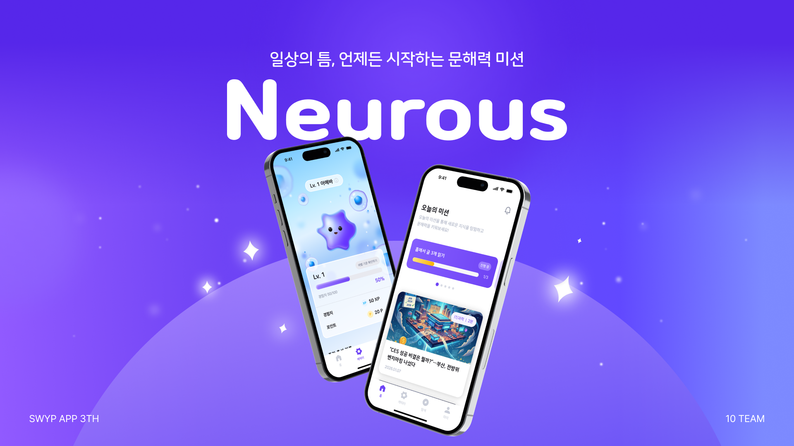

# 🧠 NEUROUS

AI로 재구성한 기사를 읽고 퀴즈를 풀며 성인 문해력을 기르는 React Native 학습 애플리케이션입니다.

포인트·경험치·캐릭터 성장과 미션을 학습 과정에 결합했으며, Android Release와 실제 운영 환경의 인증·알림·광고 문제를 대응했습니다.

  

 

## 🖼️ 주요 화면

| 홈·미션 | 학습 | 퀴즈 | 캐릭터 |
| --- | --- | --- | --- |
|  |  |  |  |
| 학습 콘텐츠와 일일 미션 탐색 | AI로 재구성된 기사 읽기 | 기사 기반 퀴즈 풀기 | 포인트·경험치 기반 성장 확인 |

| 온보딩 | 탐색 | 알림 | 마이페이지 |
| --- | --- | --- | --- |
|  |  |  |  |
| 난이도와 관심 분야 설정 | 카테고리별 기사 탐색 | 실시간·푸시 알림 확인 | 프로필, 관심 분야와 읽은 글 관리 |

 

## 📖 서비스 소개

NEUROUS는 성인 사용자가 자신의 수준과 관심 분야에 맞는 기사를 읽고 퀴즈를 풀면서 문해력을 학습하는 모바일 서비스입니다. 포인트, 경험치, 캐릭터와 출석 보상을 통해 반복적인 학습 참여를 유도합니다.

 

## 📌 프로젝트 정보

| 항목 | 내용 |
| --- | --- |
| 형태 | 팀 프로젝트 |
| 플랫폼 | Android / iOS |
| Client | React Native CLI, TypeScript |
| App ID | `io.neurous.app` |
| 담당 | 초기 버전 공동 개발, 이후 iOS Native 영역을 제외한 앱 전반 개발·유지보수** |
| 배포 | Google Play Console 내부 테스트 및 Release 환경 운영 |
| Google Play | [🍏 NEUROUS 다운로드](https://play.google.com/store/apps/details?id=io.neurous.app&pcampaignid=web_share) |
| App Store | [🍎 NEUROUS 다운로드](https://apps.apple.com/kr/app/%EB%89%B4%EB%A1%9C%EC%8A%A4-neurous/id6757225558) |
| 초기 버전 Repository | [SWYP-app-3-10/client](https://github.com/SWYP-app-3-10/client) |
| 고도화 버전 Repository | [SWYP-app-3-10/neurous-client](https://github.com/SWYP-app-3-10/neurous-client) |

 

## 👨‍💻 담당 역할

- React Native 애플리케이션 기능 개발과 유지보수
- TanStack Query와 Zustand 기반 서버·클라이언트 상태 관리
- Axios JWT 자동 재발급과 동시 Refresh 요청 제어
- Google·Kakao·Naver 로그인 연동 및 Release 환경 대응
- SSE·FCM을 이용한 앱 상태별 알림 처리
- Firebase Analytics 이벤트 설계, Mixpanel 이벤트(디자인팀 명세 기반) 연동
- AdMob 리워드 광고와 Release 설정 문제 대응
- Android AAB 생성, App Signing과 Google Play 내부 테스트 운영

 

## 🛠️ Tech Stack

| Category | Stack |
| --- | --- |
| Core | React Native, React, TypeScript |
| Navigation | React Navigation |
| Server State | TanStack Query |
| Client State | Zustand |
| Network | Axios, SSE |
| Storage | AsyncStorage |
| Authentication | Google, Kakao, Naver, Apple* |
| Service | Firebase, FCM, AdMob |
| Analytics | Firebase Analytics, Mixpanel |

 

## ✨ 주요 구현

### 서버 상태와 UI 상태 분리

TanStack Query는 API 데이터와 캐시를, Zustand는 모달·토스트·알림과 보상 표시처럼 앱 내부 UI 상태를 담당하도록 책임을 분리했습니다.

[아키텍처 자세히 보기](./docs/ARCHITECTURE.md)

### JWT 재발급과 인증 생명주기

Axios Interceptor에서 Access Token을 자동 첨부하고 만료 시 Refresh Token으로 갱신합니다. 여러 요청이 동시에 실패해도 Subscriber Queue를 통해 Refresh 요청은 한 번만 실행하고 대기 중인 요청을 순차 재시도합니다.

[인증 흐름 자세히 보기](./docs/AUTHENTICATION_FLOW.md)

### 앱 상태별 알림

Foreground에서는 SSE 연결로 이벤트를 받고, Background·종료 상태에서는 FCM을 이용합니다. FCM Token 등록과 해제를 로그인·로그아웃 생명주기에 연결했습니다.

[알림 흐름 자세히 보기](./docs/NOTIFICATION_FLOW.md)

### 학습 행동 분석

화면 조회, 온보딩, 퀴즈, 검색, 보상과 캐릭터 행동을 Firebase Analytics와 Mixpanel 이벤트로 기록해 사용자의 학습 여정을 분석할 수 있도록 구성했습니다. Firebase Analytics, Mixpanel은 디자인팀이 정의한 이벤트 명세를 기준으로 구현·연동했습니다.

[Analytics 구성 자세히 보기](./docs/ANALYTICS.md)

### Release와 운영 대응

Android AAB 생성부터 Google Play App Signing, Firebase SHA와 소셜 로그인 키 등록, AdMob Release 설정까지 실제 Release 환경을 구성하고 환경별 오류를 해결했습니다.

[배포·운영 경험 보기](./docs/DEPLOYMENT.md)

 

## 🔧 문제 해결

- 로그아웃·회원탈퇴 API보다 Token 삭제가 먼저 실행되어 발생한 401 Race Condition 해결
- 계정 전환 시 이전 사용자의 TanStack Query Cache가 노출되는 문제 해결
- 캐릭터 보상 반영 시점에 맞춰 무효화와 Prefetch 정책 개선
- Google·Kakao·Naver의 Debug·Upload·App Signing Key 차이 대응
- AdMob App ID와 Ad Unit ID 혼동으로 Release에서만 광고가 실패한 문제 해결
- UTC와 KST가 섞여 출석 보상·읽은 날짜가 어긋나는 문제 해결

[Troubleshooting 자세히 보기](./docs/TROUBLESHOOTING.md)

 

## 📚 Documentation

| Document | Description |
| --- | --- |
| [Architecture](./docs/ARCHITECTURE.md) | 앱의 계층, 상태와 데이터 흐름 |
| [Authentication Flow](./docs/AUTH_FLOW.md) | 소셜 로그인, JWT와 Refresh Queue |
| [Notification Flow](./docs/NOTIFICATION.md) | SSE·FCM 및 권한·Token 생명주기 |
| [Analytics](./docs/ANALYTICS.md) | 사용자 행동 이벤트 설계 |
| [Troubleshooting](./docs/TROUBLESHOOTING.md) | 개발·Release·운영 문제 해결 |

