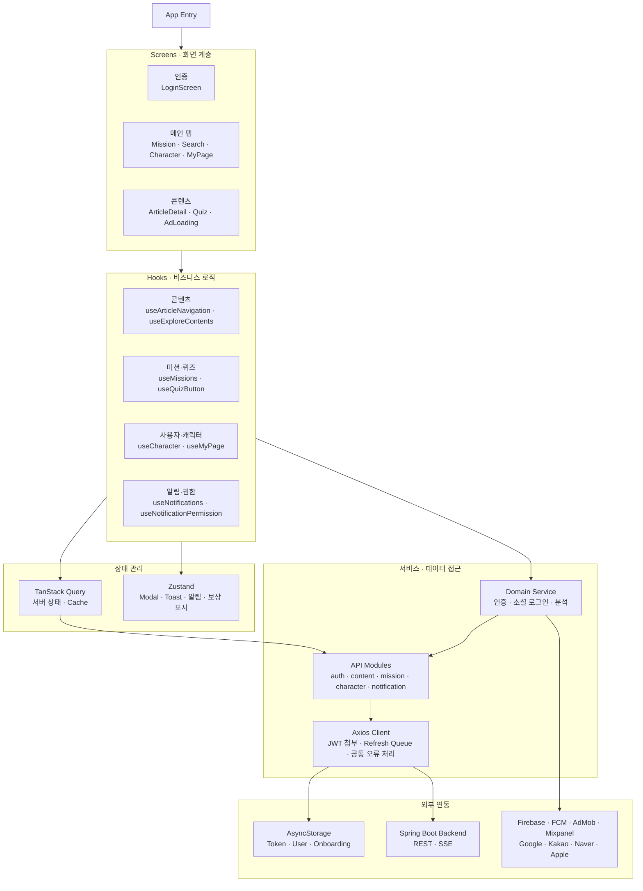
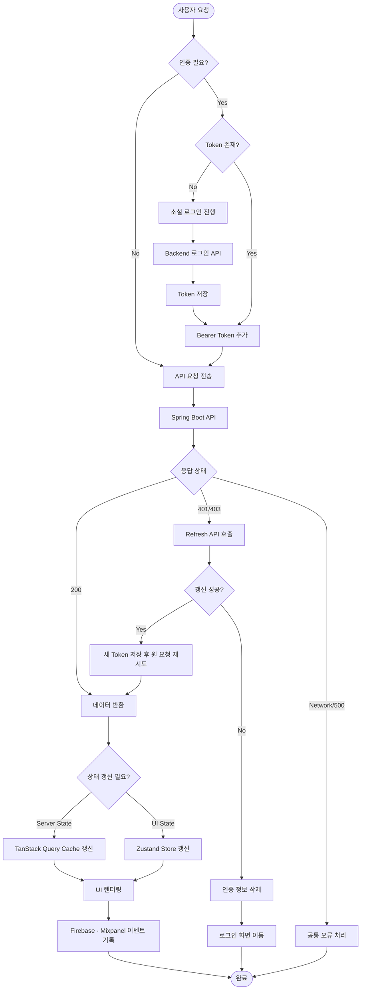
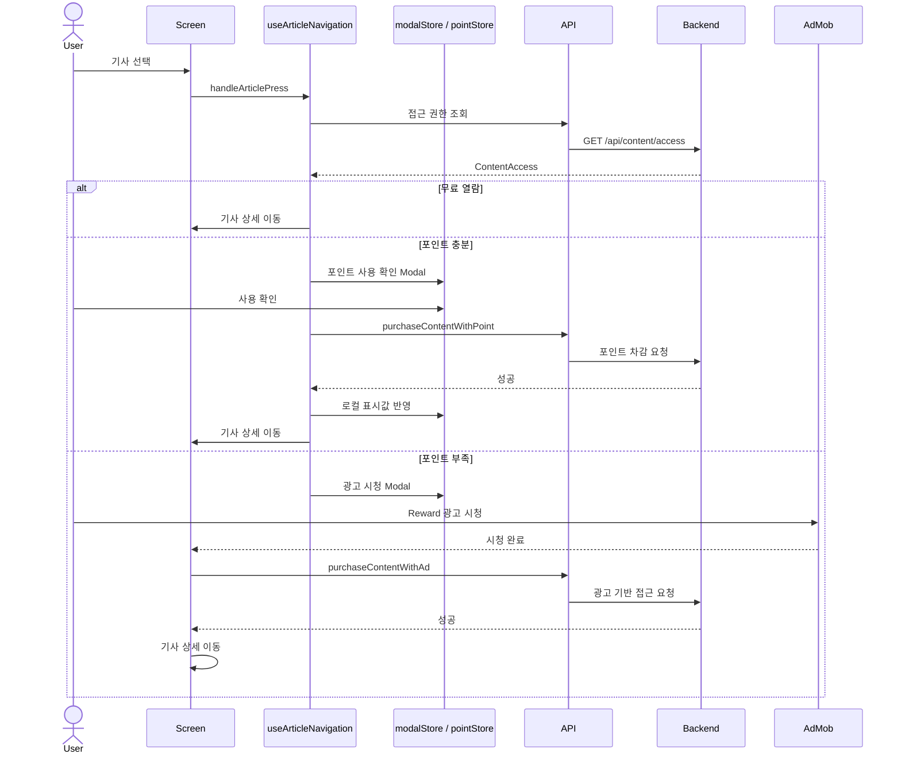
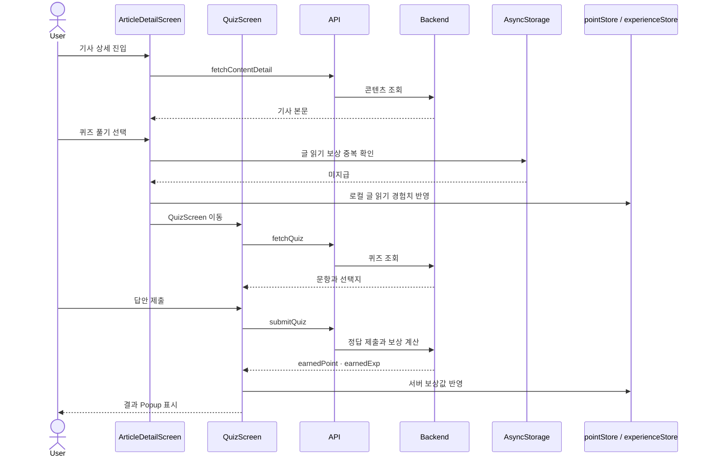
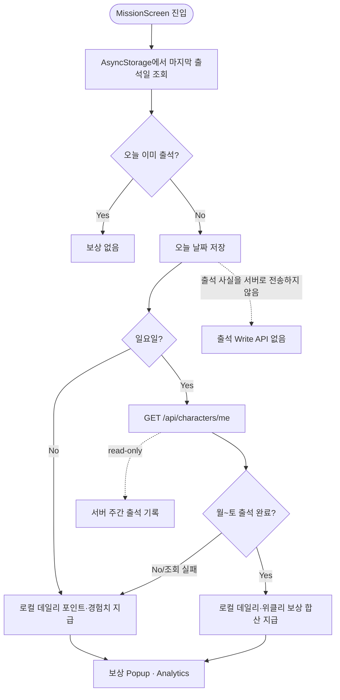
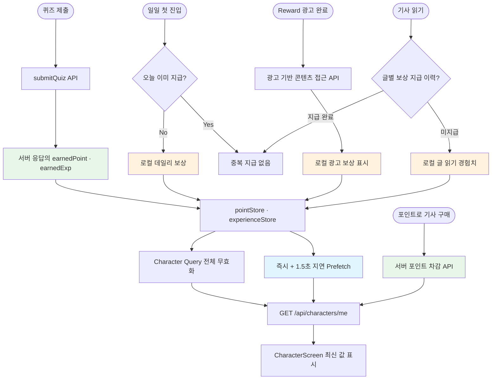

# 🏗️ Architecture

## 🧭 전체 구조

화면은 렌더링과 사용자 입력에 집중하고, 비즈니스 흐름은 Custom Hook과 Service로 분리했습니다. 서버에서 받은 데이터와 앱 내부 UI 상태는 서로 다른 도구로 관리합니다.

## 🧱 계층별 책임

| Layer | Responsibility |
| --- | --- |
| Screen | React Native UI와 Navigation |
| Hook | 화면 기능과 비즈니스 흐름 캡슐화 |
| TanStack Query | API 요청, Cache, 재시도와 무효화 |
| Zustand | Modal, Toast, 알림, 로컬 표시 상태 |
| Service | 인증, 소셜 SDK, 분석과 Storage 조합 |
| API | 도메인별 HTTP 요청 정의 |
| Axios Client | JWT 첨부, Refresh, 공통 오류 처리 |

### 주요 요청 처리 흐름

## 🔄 서버 상태와 클라이언트 상태

TanStack Query는 미션, 기사, 캐릭터, 사용자 정보처럼 서버가 원본인 데이터를 관리합니다. Zustand는 서버 Cache를 복제하지 않고 다음과 같은 앱 내부 상태에 사용합니다.

- 전역 Modal·Bottom Sheet·Toast
- 알림 표시 상태
- 온보딩 입력 상태
- 포인트·경험치의 즉각적인 UI 피드백

로그아웃·탈퇴 시 `queryClient.clear()`를 호출해 계정 간 Cache가 섞이지 않도록 합니다.

## 👤 주요 사용자 흐름

### 콘텐츠 접근

### 기사와 퀴즈

기사 상세, 퀴즈, 결과와 보상을 독립된 화면과 Hook으로 나누고 Navigation Parameter로 필요한 식별자만 전달합니다. 보상 이후에는 관련 Query를 무효화하거나 Character 데이터를 미리 조회합니다.

### 출석 보상 흐름

### 전역 UI

Modal과 Toast를 화면 내부가 아닌 Root 수준에서 렌더링합니다. 화면 이동 이후에도 필요한 알림을 유지하고, Toast는 Native Modal 대신 View Overlay를 사용해 본문 Scroll을 막지 않도록 개선했습니다.

### 보상 출처와 화면 반영

## ⚡ Cache 정책

- 화면이 사용하는 Query Key Factory로 Cache Key를 일관되게 관리
- 보상 후 관련 Character Query 전체 무효화
- 화면 Mount 시 최신 정보가 중요한 데이터는 항상 재조회
- 서버 반영 지연을 고려해 보상 직후 즉시 및 지연 Prefetch
- 로그아웃·탈퇴 시 전체 Query Cache 초기화

## ⚠️ 구조적 한계

보상 경로 중 서버 응답값을 실제 지급액으로 사용하는 것은 퀴즈뿐이며, 출석·광고 시청·글 읽기 보상은 서버 API 호출 없이(또는 호출해도 지급액과는 무관하게) 클라이언트에서 로컬 상수를 지급하는 구조입니다. 이 때문에 사용자가 즉시 보는 값과 서버에서 다시 조회한 값의 반영 시점과 출처가 다를 수 있습니다. 장기적으로는 모든 보상 결과를 서버 응답을 기준으로 통일하는 것이 필요합니다.
