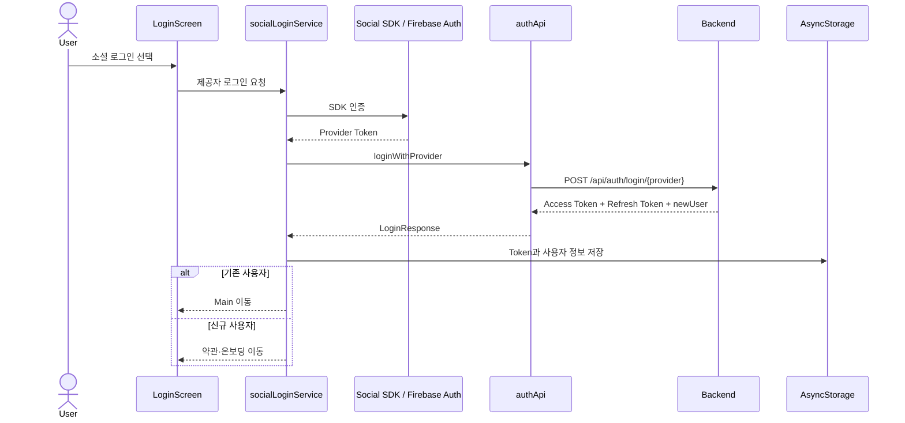
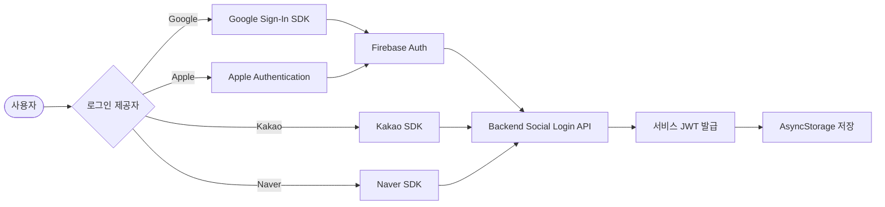
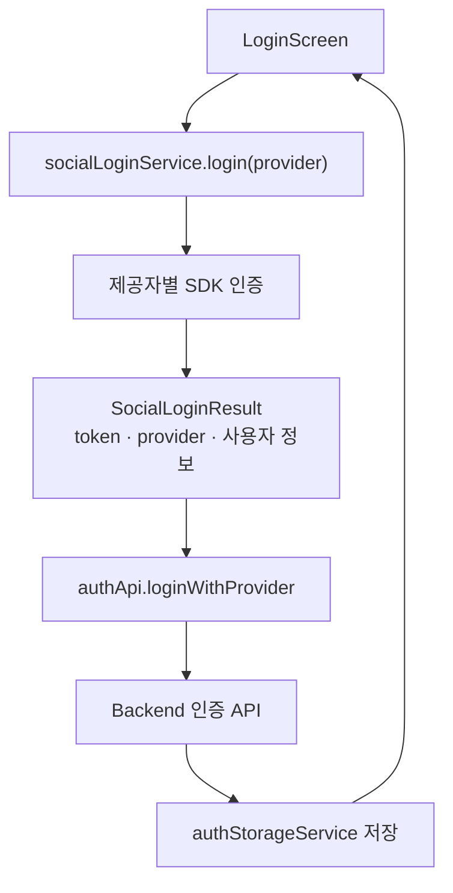
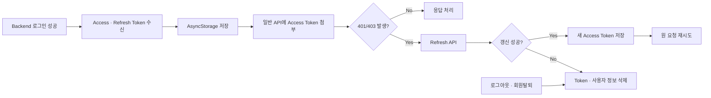
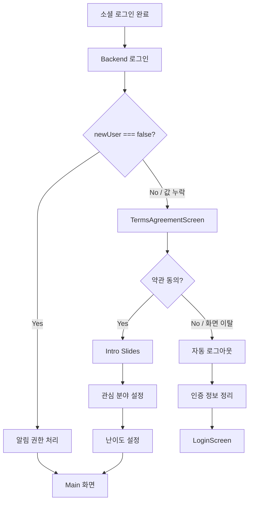
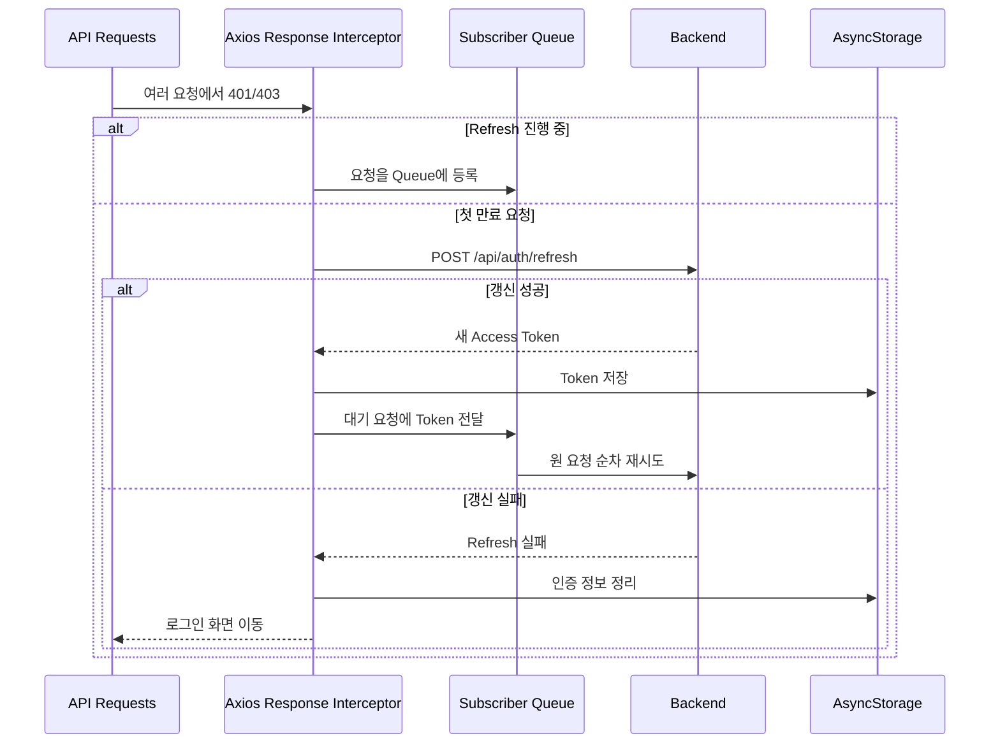
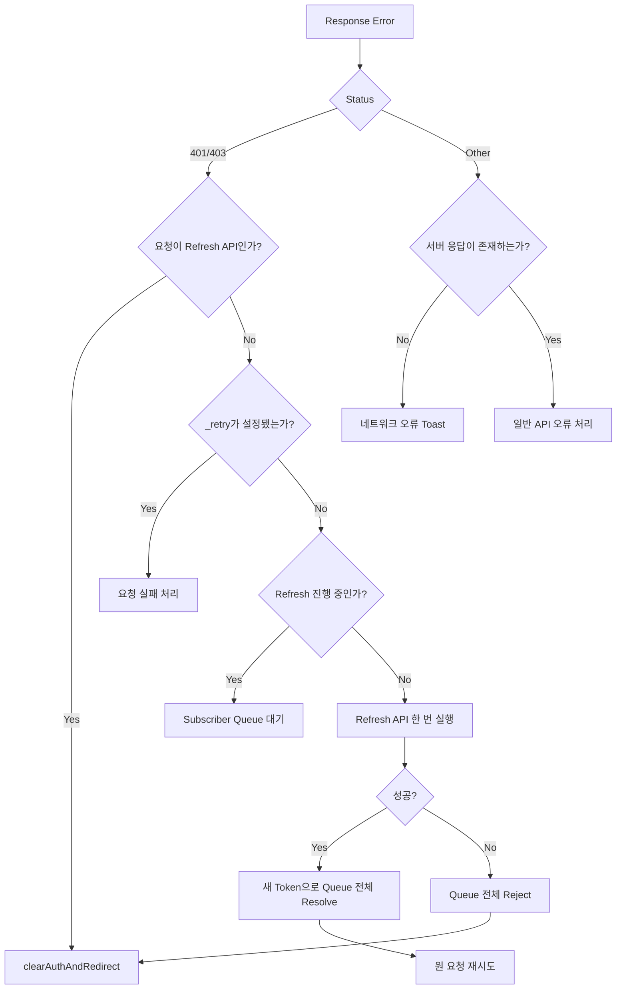
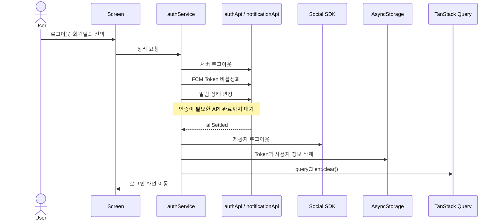

# 🔐 Authentication Flow

## 🔑 로그인 구조

NEUROUS는 Google, Kakao, Naver와 Apple 로그인을 제공합니다. 제공자별 SDK 응답을 공통 결과 형태로 변환한 뒤 Backend 로그인 API에서 서비스 JWT를 발급받습니다.

Apple 로그인은 서비스에 포함되지만 본인의 주요 구현 범위에는 포함하지 않습니다.



### 제공자별 인증 방식

| Provider | Authentication Path | Firebase Auth |
| --- | --- | --- |
| Google | Google Sign-In SDK → Firebase Auth → Backend | 사용 |
| Apple* | Apple Authentication → Firebase Auth → Backend | 사용 |
| Kakao | Kakao SDK → Backend 직접 전달 | 우회 |
| Naver | Naver SDK → Backend 직접 전달 | 우회 |

\* Apple 로그인은 다른 팀원이 구현했으며, 공통 로그인 구조에 포함된 서비스 동작을 기준으로 설명합니다.

Google과 Apple은 Firebase Credential을 생성해 인증한 뒤 Backend에서 서비스 JWT를 발급받습니다. Kakao와 Naver는 Firebase Auth를 거치지 않고 각 SDK에서 받은 Token을 Backend로 직접 전달합니다.



### SocialLoginResult 공통 인터페이스

제공자마다 SDK 응답 형태와 Token 종류가 달라 화면에서 직접 분기하면 로그인 화면이 각 SDK 구현에 강하게 결합됩니다. 이를 `SocialLoginResult` 형태로 통합하고 `socialLoginService`가 제공자별 차이를 처리하도록 분리했습니다.



### 인증 모듈의 책임

| Module | Responsibility |
| --- | --- |
| `socialLoginService.ts` | 제공자별 SDK 호출과 공통 로그인 결과 생성 |
| `authService.ts` | 로그인·로그아웃·회원탈퇴 흐름 조합 |
| `authStorageService.ts` | AsyncStorage 인증 정보 저장·조회·삭제 |
| `authApi.ts` | Backend 인증 API 요청과 응답 타입 정의 |
| `client.ts` | JWT 첨부, 갱신, Queue와 공통 오류 처리 |

## 🎫 JWT Token 관리

### 저장 구조

| AsyncStorage Key | Value |
| --- | --- |
| `@auth_token` | Access Token (JWT) |
| `@refresh_token` | Refresh Token |
| `@user_info` | 사용자 정보 JSON |

### Token 생명주기



## 🔀 신규·기존 사용자 분기

초기에는 로그인 전에 약관 화면으로 이동해 기존 사용자도 매번 약관을 확인해야 했습니다. 로그인 응답의 `newUser`를 먼저 확인하도록 순서를 바꿨습니다.

- 기존 사용자: 바로 Main으로 이동
- 신규 사용자: 약관과 온보딩 진행
- 신규 사용자가 약관 동의 전에 이탈: 인증 상태 정리를 위해 자동 로그아웃

`newUser === false`인 경우만 기존 사용자로 처리합니다. 응답에서 값이 누락되면 `newUser ?? true`를 적용해 신규 사용자로 간주합니다. 약관을 잘못 건너뛰는 것보다 한 번 더 확인하는 쪽을 안전한 기본값으로 선택했습니다.



## 📤 Request Interceptor

- 일반 API 요청에 Access Token 자동 첨부
- 로그인과 Refresh 같은 Public 인증 API에는 기존 Token을 첨부하지 않음
- Debug 환경에서만 요청·응답 진단 로그 사용

탈퇴된 계정의 Token이 남은 상태에서 새 로그인 요청에 첨부되어 서버 500이 발생한 경험을 바탕으로 Public API 제외 규칙을 추가했습니다.

### Authorization Header 제외 경로

| Path | Reason |
| --- | --- |
| `/api/auth/login/` | 인증 전 호출하는 공개 로그인 API |
| `/api/auth/refresh` | 만료된 Access Token 대신 Refresh Token으로 갱신하는 API |

회원탈퇴 과정의 일부 요청이 실패하면 이전 계정의 Token이 Storage에 남을 수 있습니다. 이 Token이 다른 계정의 로그인 요청에 첨부되면 Backend가 탈퇴 계정을 검증하는 과정에서 오류가 발생할 수 있으므로, 로그인과 Refresh 경로에는 기존 Access Token을 첨부하지 않습니다.

## 📥 Response Interceptor와 Refresh Queue



동시에 여러 요청이 만료 응답을 받아도 Refresh API가 중복 호출되지 않도록 Queue를 사용합니다. 각 원 요청에는 재시도 여부를 기록해 무한 반복을 방지합니다.

### Response Interceptor 세부 규칙

- 401·403을 받으면 Refresh API로 Access Token 갱신 시도
- 요청별 `_retry` Flag로 같은 요청의 무한 재발급 방지
- Refresh API 자체의 401·403은 Queue에 다시 넣지 않고 인증 정보 초기화
- 갱신 성공 시 Queue의 모든 요청을 새 Token으로 재개
- 갱신 실패 시 대기 중인 요청을 모두 Reject하고 로그인 화면으로 이동



## 🌐 Network Error 처리

Timeout이나 연결 끊김처럼 서버 응답 자체가 없는 오류는 401·403 Refresh 흐름과 분리합니다. `error.response` 유무를 기준으로 네트워크 오류와 서버가 응답한 4xx·5xx 오류를 구분하고 서로 다른 안내를 표시합니다.

과거에는 응답 없는 요청을 최대 두 번 자동 재시도했지만, 재시도 중 사용자에게 진행 상태가 보이지 않아 대기 시간이 길어지는 문제가 있었습니다. 현재는 자동 재시도를 제거하고 즉시 공통 Network Error Toast를 표시합니다.

## 🔁 TanStack Query 재시도 정책

Axios Interceptor가 401·403의 Token 갱신과 원 요청 재시도를 담당합니다. TanStack Query까지 같은 요청을 다시 시도하면 Refresh 흐름이 중복되거나 경합할 수 있어 인증 오류는 Query 재시도 대상에서 제외했습니다.

```ts
retry: (failureCount, error) => {
  const status = error?.response?.status;
  if (status === 401 || status === 403) {
    return false;
  }
  return failureCount < 1;
},
retryDelay: attemptIndex => Math.min(1000 * 2 ** attemptIndex, 30000),
```

| Operation | Retry Policy |
| --- | --- |
| Query | 401·403 제외, 그 외 최대 1회 재시도 |
| Mutation | 재시도하지 않음 (`retry: 0`) |

## ⚡ 로그인·로그아웃 비동기 작업

로그인 완료를 막을 필요가 없는 분석·알림 부가 작업은 Fire-and-forget으로 실행하지만, 인증 Token이 필요한 정리 API는 반드시 로컬 Token 삭제 전에 완료합니다.

| Task | Execution | Reason |
| --- | --- | --- |
| Mixpanel 사용자 식별 | Fire-and-forget | 분석 실패가 로그인 성공을 막지 않음 |
| 로그인 후 FCM Token 등록 | Fire-and-forget | 등록 완료를 기다리지 않고 화면 진입 |
| Social SDK 로그아웃 | Fire-and-forget | Backend Access Token과 무관 |
| Backend 로그아웃 | 완료 대기 | Authorization Header 필요 |
| FCM Token 비활성화 | 완료 대기 | Authorization Header 필요 |
| 알림 상태 변경 | 완료 대기 | Authorization Header 필요 |

부가 작업의 실패는 로그인·로그아웃 성공 여부에 영향을 주지 않고 Logging으로 남깁니다. 따라서 FCM 미등록이나 분석 사용자 미식별을 놓치지 않으려면 별도의 운영 Monitoring이 필요합니다.

## 🚪 로그아웃·회원탈퇴 순서

서버 로그아웃, FCM Token 비활성화, 알림 상태 변경은 모두 인증 Token이 필요합니다. 따라서 다음 순서를 보장합니다.



서버 API를 기다리지 않고 Token을 먼저 삭제했을 때 발생했던 401 Race Condition을 이 순서로 해결했습니다.
