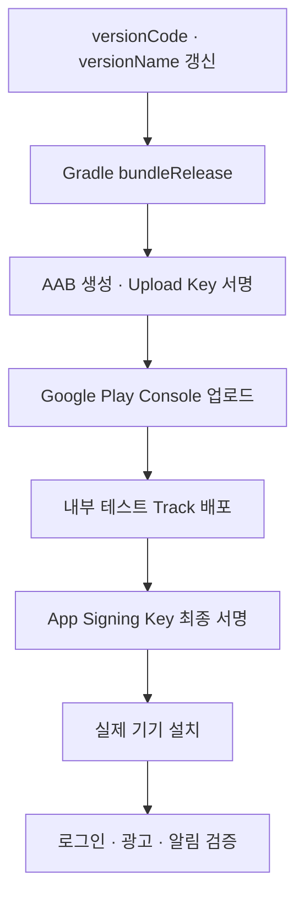

# 🚀 Deployment

## 🤖 Android Release Flow

Google Play Console 내부 테스트 Track을 이용해 Release Build를 배포하고 실제 설치 환경에서 인증과 서비스 기능을 검증했습니다.

## 🔏 Signing과 외부 서비스 등록

| Environment | Key | Required Registration |
| --- | --- | --- |
| Debug | Debug Keystore | Firebase SHA, Kakao Key Hash |
| Release Upload | Upload Key | Firebase SHA, Kakao Key Hash |
| Play Distribution | App Signing Key | Firebase SHA, Kakao Key Hash |

Play App Signing으로 전환한 뒤 Store가 최종 APK를 다시 서명하므로 App Signing 인증서도 Social Login Console에 등록했습니다.

## 🔥 Firebase·외부 서비스 마이그레이션

- Firebase 설정 파일 교체
- Google OAuth Client ID 변경
- Kakao Native App Key와 Scheme 변경
- Naver Client 설정 변경
- Android·iOS AdMob App 및 Ad Unit ID 동기화
- Firebase Analytics와 FCM 설정 확인

민감 설정 파일과 Key는 Git에 포함하지 않고 별도로 전달하거나 환경 설정에서 관리합니다.

## 🔧 Release 환경 문제 대응

- Google 로그인: App Signing SHA 누락으로 Store Build 실패
- Kakao 로그인: Key Hash와 Manifest 설정 불일치
- Naver 로그인: R8 난독화로 Callback 동작 실패
- AdMob: App ID와 Ad Unit ID 혼동 및 계정 불일치
- Firebase: 설정 파일 누락 시 White Screen과 Archive 실패

