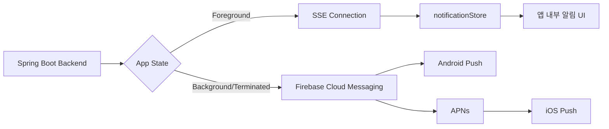
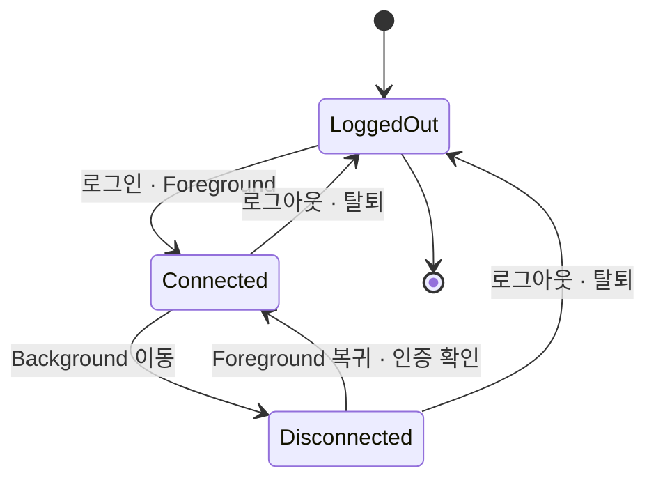
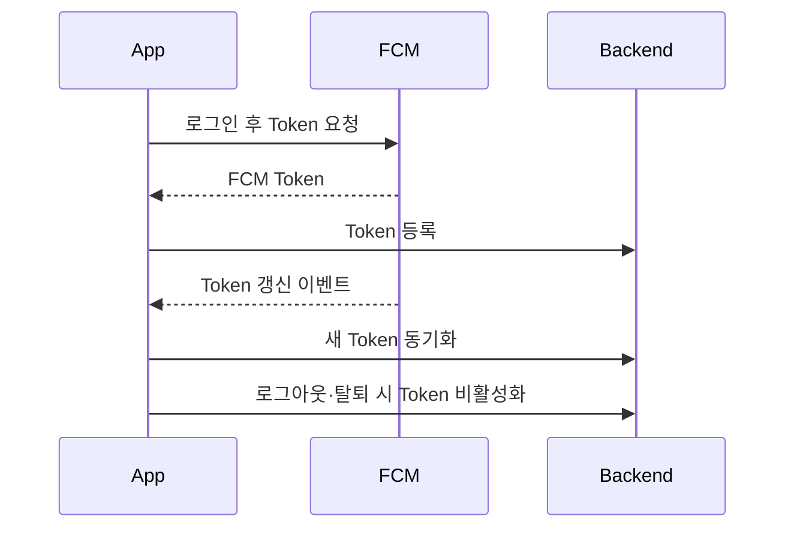
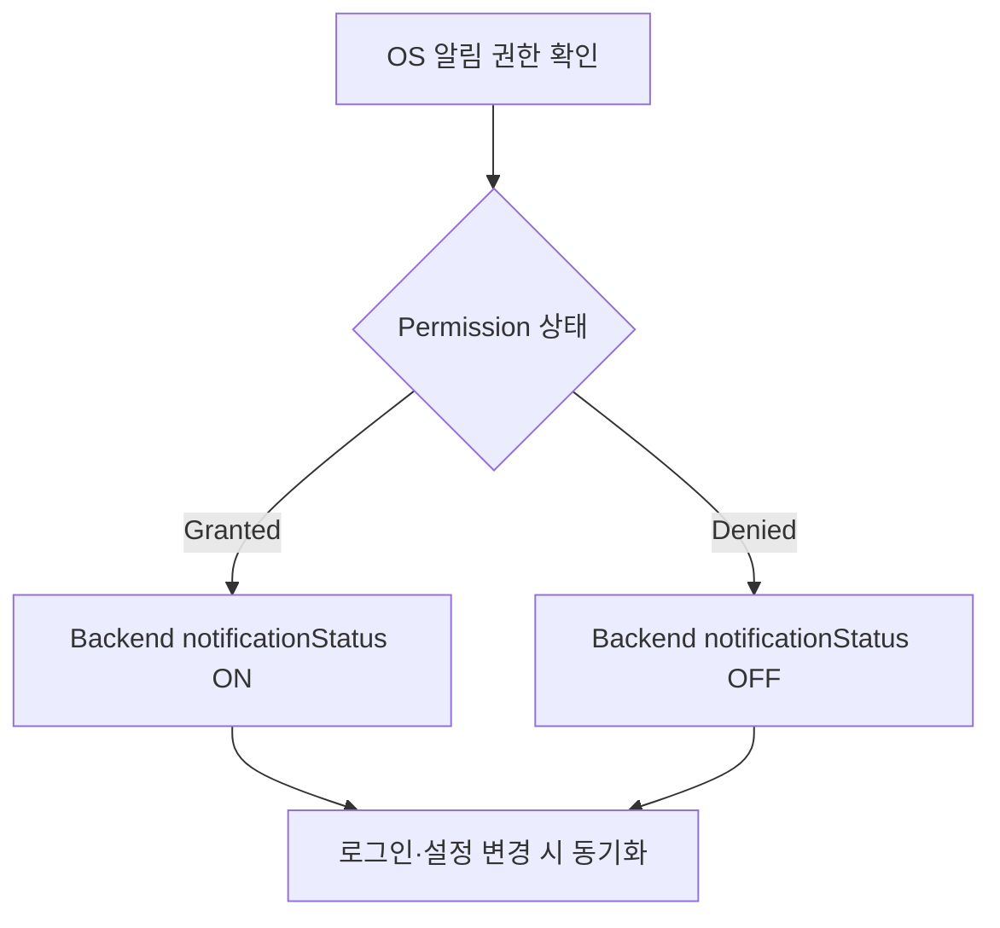

# 🔔 Notification Flow

## 📱 앱 상태별 채널

| App State | Channel | Role |
| --- | --- | --- |
| Foreground | SSE | 열린 앱에 실시간 이벤트 전달 |
| Background | FCM | OS Push Notification 전달 |
| Terminated | FCM | 앱 종료 상태에서 Push 전달 |

## ⚡ SSE 생명주기

1. 로그인 후 SSE 연결을 시작합니다.
2. 서버 이벤트를 수신하면 알림 Store와 화면에 반영합니다.
3. 앱이 Background로 이동하면 연결을 해제합니다.
4. Foreground 복귀 시 인증 상태를 확인하고 다시 연결합니다.

앱이 보이는 동안 별도의 Push Banner에만 의존하지 않고 서비스 내부 상태를 즉시 갱신하기 위한 채널입니다.

## 🔑 FCM Token 생명주기

- 로그인: FCM Token 발급 후 Backend 등록
- 로그아웃·탈퇴: Backend에서 Token 비활성화
- Token 갱신: 새 Token을 Backend와 동기화

Token 등록 여부와 사용자의 알림 설정은 별개의 개념입니다. Token은 로그인 생명주기에, 알림 허용 상태는 OS 권한에 맞춰 관리합니다.

## 🔄 권한 동기화

OS 알림 권한을 Source of Truth로 사용합니다.

로그인, 로그아웃과 설정 Toggle 변경 시 Backend 상태를 동기화합니다. iOS에서는 FCM이 APNs를 통해 전달되므로 Firebase Console에 APNs 인증 키가 필요합니다.

## ✅ 읽음 상태

사용자가 알림을 확인하면 서버의 읽음 상태와 동기화합니다. 알림 목록의 표시 상태를 단순 로컬 값으로만 유지하지 않아 재로그인과 다른 기기에서도 일관된 상태를 유지합니다.
z
