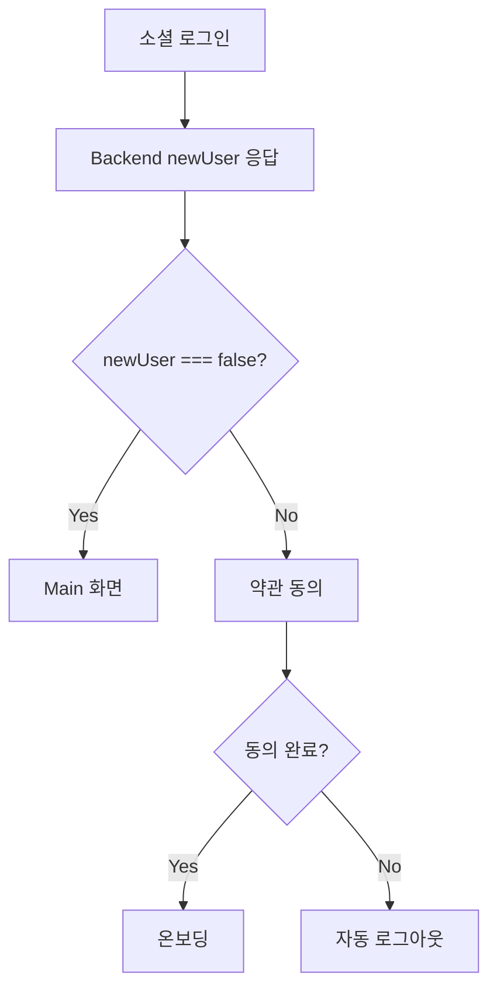
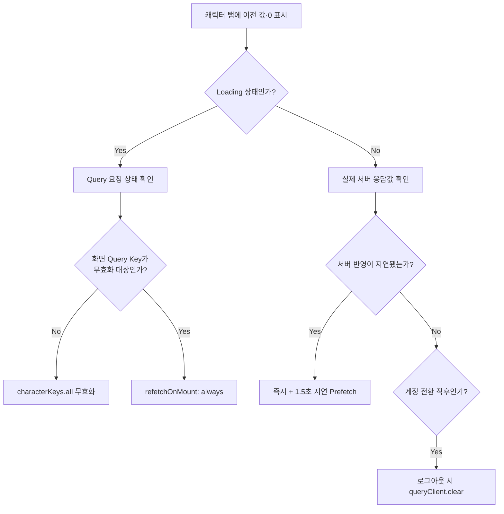

# 🔧 Troubleshooting

## 🔑 소셜 로그인

### Google 로그인 DEVELOPER_ERROR — Play Store Build

- **증상**: Local Debug Build에서는 정상이나 Play Console 내부 테스트 앱에서 Google 로그인이 실패했습니다.
- **원인**: Play App Signing Key의 SHA-1·SHA-256이 Firebase에 등록되지 않았습니다.
- **해결**: Play Console에서 App Signing 인증서 지문을 확인해 Firebase에 등록하고 `google-services.json`을 다시 발급했습니다.

### Google·Kakao Debug Key 불일치

- **증상**: 배포 Build 대응 후 Debug Build에서 Google `ApiException 12500`과 Kakao `keyHash validation failed`가 발생했습니다.
- **원인**: Debug Keystore의 SHA와 Key Hash가 각 Console에 등록되지 않았습니다.
- **해결**: Debug SHA-1·SHA-256과 Kakao Key Hash를 추출해 Release·App Signing 값과 함께 등록했습니다.
- **교훈**: Debug, Upload와 App Signing은 서로 다른 인증서이므로 사용하는 환경의 지문을 각각 등록해야 합니다.

### App Signing Key 변경 후 Kakao 로그인 실패

- **증상**: App Signing Key 업그레이드 후 Play Store 배포 앱에서 Kakao 로그인이 실패했습니다.
- **원인**: Kakao Developers에는 기존 Upload Key Hash만 등록되어 있었습니다.
- **해결**: Play Console의 App Signing SHA-1을 Kakao Key Hash로 변환해 추가하고, Upload Key Hash는 Local Release 검증용으로 유지했습니다.

### Naver Release Build 로그인 실패

- **증상**: R8·ProGuard가 활성화된 Release Build에서 로그인 후 Splash 화면으로 돌아갔습니다.
- **원인**: Naver SDK Callback Class가 난독화되어 정상 호출되지 않았습니다.
- **해결**: Keep Rule을 적용해 검증하고, 동작을 보장할 수 없는 설정에서는 난독화를 제한했습니다.

### Naver 로그인 취소 시 Promise 미종료

- **증상**: 사용자가 Naver 로그인을 취소하면 Promise가 종료되지 않아 로그인 화면이 대기 상태에 머물렀습니다.
- **원인**: 취소 Callback에서 SDK Promise가 Resolve·Reject되지 않는 문제가 있었습니다.
- **해결**: `Promise.race`와 Timeout을 적용해 일정 시간 내 응답이 없으면 실패로 종료하도록 우회했습니다.

### Kakao 로그인 시 앱 강제 종료

- **증상**: Kakao 로그인 시작 직후 Android 앱이 종료됐습니다.
- **원인**: `AndroidManifest.xml`에 Kakao 관련 Metadata가 중복 선언되어 있었습니다.
- **해결**: 중복 선언을 제거하고 하나의 설정만 유지했습니다.

## 🔐 인증

### 탈퇴 후 다른 계정 로그인 시 서버 500

- **증상**: A 계정 탈퇴 후 앱을 재설치하지 않고 B 계정으로 로그인하면 서버 500이 발생했지만, 재설치 후에는 정상 동작했습니다.
- **원인**: 탈퇴 흐름이 중간에 실패해 이전 `@auth_token`이 남았고, Request Interceptor가 공개 로그인 API에도 이 Token을 첨부했습니다.
- **해결**: `/api/auth/login/`과 `/api/auth/refresh`를 Authorization Header 제외 경로로 지정했습니다.
- **수정 영역**: `src/api/client.ts`

### 로그아웃·탈퇴 과정의 401 Race Condition

#### 문제

로그아웃과 회원탈퇴 시 서버 로그아웃, FCM Token 해제와 알림 설정 API가 모두 401을 반환했습니다.

#### 원인

서버 API들을 기다리지 않고 실행한 직후 AsyncStorage Token을 삭제했습니다. Axios Request Interceptor가 비동기로 Token을 읽기 전에 삭제가 완료되면 인증 Header 없이 요청이 전송됐습니다.

#### 해결

인증이 필요한 서버 정리 API가 모두 끝난 뒤 Token을 삭제하도록 순서를 변경했습니다. Backend Token과 무관한 Social SDK 로그아웃만 비동기로 유지했습니다.

### 계정 전환 시 이전 사용자 Cache 노출

#### 문제

로그아웃 후 다른 계정으로 로그인하면 이전 사용자의 캐릭터 정보가 잠시 보였습니다.

#### 원인과 해결

TanStack Query Client가 앱 전역 Singleton이고 Query Key에 사용자 ID가 없었지만 로그아웃 시 Cache를 비우지 않았습니다. 로그아웃과 탈퇴 후 `queryClient.clear()`를 호출해 계정 경계를 명확히 했습니다.

### 기존 사용자에게도 약관이 반복 노출

- **증상**: 이미 가입한 사용자도 소셜 로그인 때마다 약관 동의 화면을 거쳤습니다.
- **원인**: 신규 여부를 알 수 있는 Backend 로그인보다 약관 화면 이동이 먼저 실행됐습니다.
- **해결**: 로그인 응답의 `newUser`를 확인한 뒤 기존 사용자는 Main으로, 신규 사용자만 약관·온보딩으로 이동하도록 순서를 변경했습니다.
- **보완**: 로그인 완료 후 약관에 동의하지 않고 이탈하면 서버·클라이언트 인증 상태가 어긋나지 않도록 자동 로그아웃합니다.

## 🎨 UI / UX

### 캐릭터 정보 반영 지연

같은 “이전 값이 보이는” 증상에 세 가지 원인이 있었습니다.

| Cause | Resolution |
| --- | --- |
| 실제 화면 Query Key가 무효화 대상에서 누락 | Character Key 전체 무효화 |
| Mount 시 Cache 값을 먼저 사용 | 중요한 Query는 Mount마다 재조회 |
| 조회 시점에 서버 보상 반영이 아직 끝나지 않음 | 보상 직후 즉시 및 1.5초 지연 Prefetch |

로딩이 아니라 실제 0이나 빈 값이 표시됐는지를 기준으로 Cache 문제와 서버 반영 지연을 구분했습니다.

### 마이페이지 읽은 내역 날짜 오표시

- **증상**: 읽은 글이 실제 열람일과 다른 날짜 또는 연도에 표시됐습니다.
- **원인**: 주 시작일·연도 계산 오류와 서버 UTC `readAt`을 KST 변환 없이 분류한 문제가 겹쳤습니다.
- **해결**: Day.js UTC·Timezone Plugin을 적용하고 날짜 계산을 `Asia/Seoul` 기준으로 통일했으며 주 시작을 월요일로 변경했습니다.

### 온보딩 Slide 전환 시 Text 깜빡임

- **증상**: Swipe 중 이미지는 이동했지만 Text가 늦게 전환되며 깜빡였습니다.
- **원인**: Scroll이 완전히 끝난 뒤 호출되는 `onMomentumScrollEnd`에서 Fade를 시작했습니다.
- **해결**: `onScroll`과 `scrollEventThrottle={16}`으로 Offset을 추적하고 절반 지점에서 Fade를 실행했습니다. Button 이동은 별도 Ref로 구분해 중복 전환을 막았습니다.

### 위클리 출석 보상의 UTC·Local 기준 불일치

- **증상**: KST 자정부터 오전 9시 사이에 출석 중복 방지 날짜와 일요일 판정이 어긋날 수 있었습니다.
- **원인**: 날짜 Key는 UTC `toISOString()`, 요일은 Local `getDay()`로 계산했습니다.
- **해결**: 하나의 `Date`와 `getLocalDateKey()`를 사용해 날짜 Key와 요일을 Local 기준으로 통일했습니다.

### Toast 노출 중 Article Scroll 차단

- **증상**: 기사 진입 안내 Toast가 사라질 때까지 본문을 Scroll할 수 없었습니다.
- **원인**: Toast가 React Native `Modal`로 구현되어 뒤쪽 화면으로 Touch가 전달되지 않았습니다.
- **해결**: Root 화면 트리 내부의 Absolute Overlay `View`로 교체하고 `pointerEvents`를 조정해 Touch와 Scroll이 통과하도록 했습니다.

### 읽은 글에 동작하지 않는 Quiz Button 노출

- **증상**: Quiz를 풀지 않은 읽은 글에도 `퀴즈 보기` Button이 나타났지만 눌러도 동작하지 않았습니다.
- **원인**: Quiz Section은 조건부 렌더링인데 하단 Button은 항상 렌더링됐습니다.
- **해결**: Quiz Data가 있을 때만 Button을 표시하고, Button이 없을 때 불필요한 하단 Padding도 제거했습니다.

### 로그인 화면 문구 변경이 반영되지 않음

- **증상**: Code에서 Tagline을 바꾸고 Cache·Clean Build를 수행해도 이전 문구가 계속 보였습니다.
- **원인**: 이전 문구가 Background PNG에 Raster Text로 포함돼 있었고, 새 Text는 배경과 같은 색상이라 보이지 않았습니다.
- **해결**: 투명 Logo Image와 Live Text를 분리하고 Text Color를 배경과 대비되는 색으로 변경했습니다.
- **교훈**: 문구가 갱신되지 않을 때 Build Cache뿐 아니라 Image에 Text가 포함됐는지와 실제 렌더링 색상을 함께 확인해야 합니다.

### 문의하기 화면에서 Keyboard가 입력 영역을 가림

- **증상**: Android에서 Keyboard가 열린 뒤 입력 중인 내용을 볼 수 없었습니다.
- **원인**: `KeyboardAvoidingView`의 Android `behavior`가 지정되지 않았습니다.
- **해결**: iOS는 `padding`, Android는 `height`를 사용하도록 설정했습니다.

### 잘못된 Email로도 문의 전송 가능

- **증상**: Email이 비어 있거나 형식이 잘못돼도 전송 Button이 활성화됐습니다.
- **원인**: 활성화 조건이 문의 내용 길이만 검사했습니다.
- **해결**: Local Part, `@`, Domain, 허용 문자와 길이를 검증하고, 유효한 Email과 최소 내용 길이를 모두 만족할 때만 Button을 활성화했습니다.

## 📢 AdMob Release 광고 실패

### 문제

테스트 광고는 정상인데 Release의 Reward 광고만 항상 로드에 실패했습니다.

### 원인과 해결

Android 설정에 Ad Unit ID가 아니라 App ID가 들어 있었고 iOS 설정은 다른 AdMob 계정 값과 섞여 있었습니다. App ID(`~`)와 Ad Unit ID(`/`)를 구분해 실제 Console 값으로 교체하고 Android·iOS 설정을 같은 계정으로 맞췄습니다.

설정값은 `src/config/api.ts`, `Info.plist`와 `app.json`에 분산되어 있었으므로 세 위치의 Android·iOS App ID와 Ad Unit ID가 같은 AdMob 계정을 가리키도록 동기화했습니다. 사용자에게는 모든 광고 오류를 Network Error로 표시하고 있어 실제 설정 오류가 드러나지 않았기 때문에, Console Error와 ID 형식도 함께 확인했습니다.

## 🧮 데이터 표시

### 날짜와 Timezone 불일치

UTC `toISOString()`으로 만든 날짜 Key와 Local `getDay()`를 함께 사용해 KST 자정부터 오전 9시 사이 Weekly 출석 판정이 어긋날 수 있었습니다. 날짜 Key와 요일을 하나의 Local Date 기준으로 통일했습니다.

읽은 글 날짜는 Day.js UTC·Timezone Plugin을 적용해 서버 UTC 시간을 KST로 변환한 뒤 그룹화했습니다.

### Progress 0% 오표시

서버가 내려준 정상적인 `0`을 `value || fallback`이 없는 값으로 판단해 잘못된 계산값으로 대체했습니다. `??`를 사용해 `0`을 유효한 값으로 유지하고 값이 실제로 없을 때만 fallback을 적용했습니다.

## 🍎 iOS Build·설정

### 신규 환경에서 Archive 실패

- **증상**: `Build input file cannot be found: GoogleService-Info.plist` 오류로 Archive가 실패했습니다.
- **원인**: Firebase 설정 파일을 Finder에만 복사하고 Xcode Project와 Target Membership에 추가하지 않았습니다.
- **해결**: Xcode의 Add Files to Project로 파일을 등록하고 Target Membership을 확인했습니다.

### ATS로 HTTP Backend 요청 차단

- **증상**: iOS에서 HTTP Backend 요청이 Network Error로 실패했습니다.
- **원인**: App Transport Security가 암호화되지 않은 HTTP 통신을 기본 차단합니다.
- **해결**: `Info.plist`의 `NSExceptionDomains`에 필요한 서버 Domain 범위를 명시했습니다.

### CocoaPods 설치 무한 대기

- **증상**: `pod install`이 특정 Library를 받는 과정에서 CPU 사용 없이 멈췄습니다.
- **원인**: 해당 의존성 다운로드에 필요한 Git LFS가 설치되지 않았습니다.
- **해결**: Git LFS 설치 후 관련 Cache를 정리하고 Pods를 다시 설치했습니다.

## 📦 Package·Patch

### lottie-react-native Patch 적용 실패

- **증상**: `npm install`의 `patch-package` 단계가 실패하고 Patch 재생성 시 `Filename too long` 오류가 발생했습니다.
- **원인**: Build가 수행된 `node_modules/lottie-react-native`에서 Patch를 생성해 `android/build`, `.gradle` 등의 Binary 산출물이 함께 포함됐습니다.
- **해결**: Package 내부 Build 산출물을 제거한 뒤 Patch를 다시 생성하고 실제 Source 변경 두 파일만 Diff에 포함됐는지 확인했습니다.
- **교훈**: Native Package Patch를 만들기 전에 해당 Package의 Android·iOS Build 산출물을 정리해야 합니다.

### Mixpanel 추가 후 Gradle 의존성 다운로드 실패

- **증상**: Android Build 중 Maven·Gradle Repository 연결이 Timeout 또는 DNS 오류로 실패했습니다.
- **원인**: Browser 요청은 정상이지만 Gradle JVM에서만 재현돼 Network·DNS 또는 Emulator NAT 불안정 가능성을 확인했습니다. 단일 원인으로 확정하지는 못했습니다.
- **해결**: DNS Cache 초기화, JVM IPv4 우선 설정, Network 환경과 실제 기기 USB 연결을 순서대로 점검해 Build를 완료했습니다.

## 💻 개발 환경

### Metro Bundler와 Node.js Version 불일치

- **증상**: `configs.toReversed is not a function` 오류로 Metro가 시작되지 않았습니다.
- **원인**: Metro 설정은 Node.js 20 API를 사용하지만 개발 환경에는 Node.js 18이 설치돼 있었습니다.
- **해결**: Node.js를 20으로 업그레이드했습니다.

### 신규 개발 환경에서 White Screen

- **증상**: Firebase 초기화 실패 메시지와 함께 앱이 빈 화면에 머물렀습니다.
- **원인**: Git에 포함하지 않는 Firebase·API·Social Login 설정 파일이 새 환경에 전달되지 않았습니다.
- **해결**: 필요한 비공개 설정 파일 목록과 전달 절차를 문서화해 개발 환경 구성 단계에서 확인하도록 했습니다.
